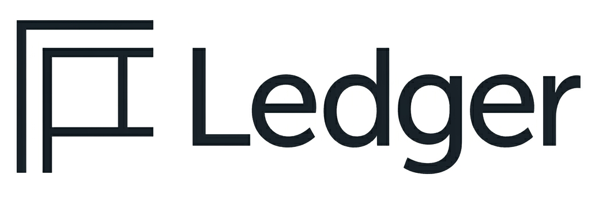

<p align="center">
    
</p>
<p align="center">
    RAG LLM CLI for querying the Superstore dataset.
</p>

## Usage

```bash
# Prepare the vector store
python main.py prepare

# Search the vector store
python main.py search "top selling products"

# Start an interactive chat session
python main.py chat

# Enable debug logging
python main.py --debug chat
```

## Providers

Ledger supports [Ollama](https://ollama.com) or [Groq](https://groq.com).

Set `GROQ_API_KEY` in your environment to use the Groq provider.
