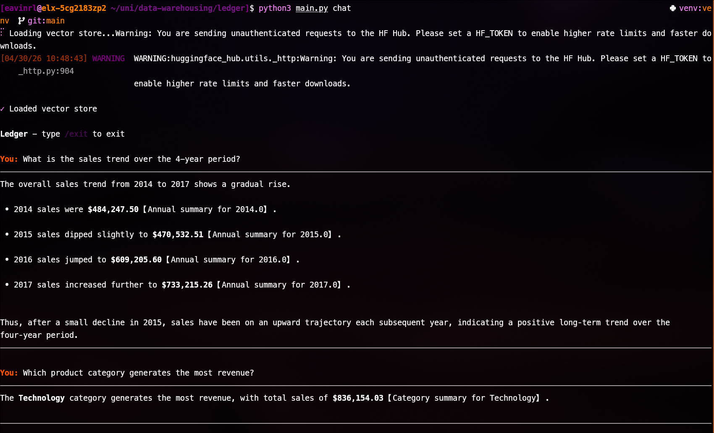
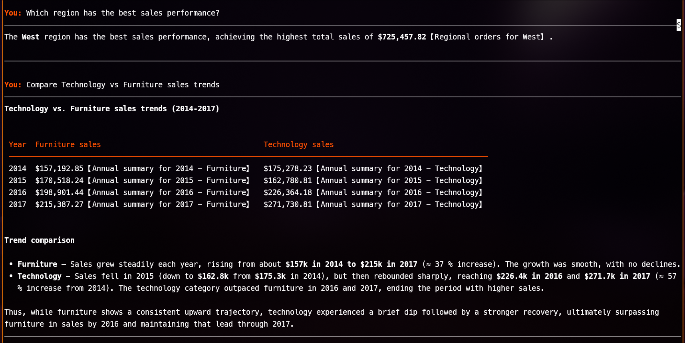
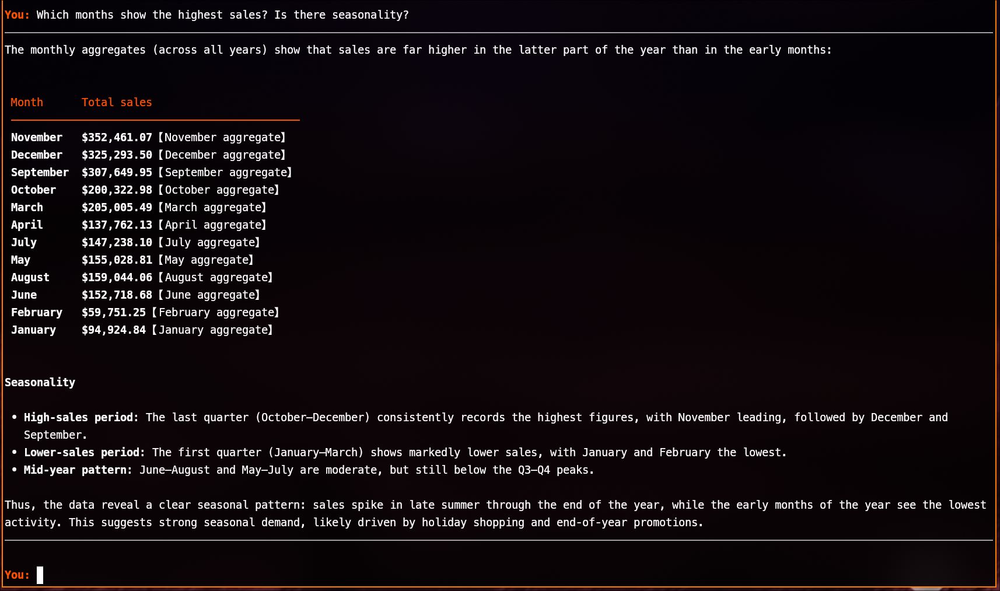

# Ledger - Technical Report

Viljami - Data Warehouse - April 2026

## System Architecture

Ledger is a CLI RAG chatbot that answers questions about the Superstore dataset (9,994 transactions, 2014–2017).
The system follows a three-phase pipeline: Indexing -> Retrieval -> Generation.

During indexing, the CSV is loaded with Pandas, converted into natural language summaries at multiple levels, chunked, embedded with all-MiniLM-L6-v2, and stored in ChromaDB with metadata.

During retrieval, a user query is embedded with the same model, matched against the vector store via cosine similarity, and filtered by metadata.

During generation, the top-k retrieved chunks are injected into a prompt template, then sent to an LLM (Groq) which produces an answer.

The project uses a Python module layout:

- `main.py` — CLI entrypoint (commands: prepare, search, chat, evaluate)
- `preparation.py` — data loading, text generation, chunking
- `vector_store.py` — ChromaDB wrapper
- `rag_pipeline.py` — retrieval, routing and prompt construction
- `llm_provider.py` — LLM abstraction with support for Ollama and Groq
- `evaluation.py` — LLM-as-judge evaluation suite
- `config.py` — environment-based configuration

## Data Preprocessing and Chunking

The Superstore CSV is tabular data, which requires some conversion since embedding models are designed for natural language.
The `preparation.py` converts the data into 14 types of natural language summaries.

The module creates summaries for individual rows by converting each of the transactions into a natural language sentence.
For example:

```
Order CA-2016-152156 on 2016-11-08: Customer Claire Gute from Henderson,
Kentucky, South ordered 2 'Bush Somerset Collection Bookcase' with ship mode
Second Class, generating $261.96 in sales and $41.91 in profit.
```

On top of the individual rows, it generates aggregated summary texts: monthly totals, cross-year monthly aggregates, yearly summaries with profit margins, year × category breakdowns, region/state/city summaries, category and sub-category summaries, product summaries, and ranking texts for states, cities, and sub-categories by sales, profit, and profit margin.
These summaries enable Ledger to answer questions like "total sales in 2016" without requiring the LLM to calculate the values.

The ranking texts were a key addition, without them the system couldn't answer questions like "top states by sales" because cosine similarity doesn't understand numeric ordering.
Pre-computing the rankings as retrievable text chunks solved this.

Each text document has a type metadata field (e.g., `region_summary`, `year_category_summary`) plus dimension-specific fields (e.g., `region`, `year`) that enables metadata filtering.

Chunking is character-based with a 500-character limit.
Most summaries fit within one chunk, so splitting primarily affects the individual row descriptions.
The chunker preserves metadata across splits so all chunks remain filterable.
The 500 chunk size was chosen because it's small enough for precise retrieval with the 384-dimensions, but large enough to retain meaningful context for all summary types.

I tested chunk sizes of 500, 1000 and 2000 characters.
Larger sizes reduced the total chunk count but hurt retrieval precision.
Broad summaries would get mixed into a single chunk, making it harder for cosine similarity to match specific queries.
500 gave the best evaluation scores.

## Embedding Model and Vector Database

I went with `all-MiniLM-L6-v2` for embeddings.
It's lightweight (~80 MB), runs on CPU, produces 384-dimensional vectors and ChromaDB has a built-in adapter for it so there's no extra setup.
The quality is good enough for the kind of queries the system is doing.

ChromaDB with PersistentClient for on-disk storage was chosen as vector database because it's simple: runs in-process, no external servers, just persists to local files.
The vector store also has built-in metadata filtering with where.

## LLM Selection and Prompt Engineering

Ledger provides two LLM providers with the `llm_provider.py` module: Ollama (local) and Groq (cloud).
The LLM provider can be configured via the environment variables.
The reason for the Groq provider was that Mistral 7B and Phi3 through Ollama were painfully slow on my hardware, making iterative testing impossible.

The prompt follows a four-part structure: system role, context, grounding rules and the query.
The system prompt instructs the LLM to act as a data analyst, use only the provided context and cite specific numbers.

A key design decision is keyword-based query routing in `rag_pipeline.py`.
Before vector search, the system scans the query for keywords (e.g., "state", "region", "category") and maps them to relevant chunk types with a $in metadata filter on ChromaDB.
This narrows the search space so a question about "top states by sales" retrieves state summaries and rankings rather than unrelated city or product chunks.
This made a significant difference in retrieval quality.

```text
You are a data analyst assistant.
You answer questions about the Superstore dataset.
Use only the provided context to answer.
If the context doesn't contain enough information, say that there is not enough information.
Always cite specific data.
```

The retrieved chunks are inserted as context followed by the query:

```
Context:
{context}

Question: {question}

Answer based on the context above:
```

## Sample Queries and Responses

The system handles 11 queries across 4 categories: trend analysis, category analysis, regional analysis and comparative analysis.
See [Appendix](#appendix) for screenshots of the chat interface showing actual queries and responses.

### Evaluation

The system was iteratively evaluated using an LLM-as-judge approach.
For each of the 11 test questions, I first computed the correct answer manually using Python and Pandas on the raw dataset.
These ground truth values (e.g. "West region: $725,457.82 in sales") serve as the reference.
Each question also has a set of criteria that define what a good answer should contain (e.g. "identifies the top region with a dollar amount").

The evaluation runs as follows:

1. The RAG system answers each question normally.
2. A separate LLM (the judge) receives the question, the ground truth, the criteria and the RAG answer.
3. The judge scores the answer 1–5 based on factual accuracy against the reference and whether the criteria are met.

This was run iteratively across 8 versions of the system.
Each time a query scored poorly, I investigated the retrieval results and improved the data preparation or routing logic.
The system improved from 3.73 (v6) to 4.82 (v8).
Full evaluation history: [evaluations.md](https://github.com/3nd3r1/ledger/blob/main/docs/evaluations.md)

| Category    | Query                                | Score |
| ----------- | ------------------------------------ | ----- |
| Trend       | Sales trend over 4 years             | 5/5   |
| Trend       | Highest sales months / seasonality   | 5/5   |
| Trend       | Profit margin over time              | 5/5   |
| Category    | Top revenue category                 | 5/5   |
| Category    | Highest profit margin sub-categories | 5/5   |
| Category    | Products frequently sold at discount | 3/5   |
| Regional    | Best sales region                    | 5/5   |
| Regional    | State sales comparison               | 5/5   |
| Regional    | Top cities by sales                  | 5/5   |
| Comparative | Technology vs Furniture trends       | 5/5   |
| Comparative | West vs East profit                  | 5/5   |

10 out of 11 queries scored 5/5.
The one failing query (discount ranking, 3/5) is because the LLM ranked sub-categories by discount rate (percentage) instead of raw count.
Both are valid interpretations of "frequently sold at a discount."

## Challenges and Solutions

Encoding. The Superstore CSV triggered an UnicodeDecodeError on load.
This was resolved by using latin-1 in pd.read_csv().

Local model performance.
Ollama models (Mistral 7B, Phi3) were unusably slow on my hardware. Switched to Groq cloud.

Ranking queries.
Cosine similarity finds semantically similar text, not the numerically ordered results.
A query like "top states by sales" would retrieve state summaries in arbitrary order.
Solved by pre-computing ranking texts at index time so "Top 10 states by sales: 1. California $457K..." exists as a single retrievable chunk.

Insufficient context.
State and city queries require a lot of chunks to cover all relevant information.
I experimented with dynamic top_k based on query type, but the results were inconsistent.
A fixed top_k of 20 gave the best overall performance.

Rate limits.
The evaluation suite makes 22 calls (11 RAG + 11 judge) per run.
With llama-3.1-8b-instant the free tier limit was 7K tokens per minute, which was not enough.
Switched to openai/gpt-oss-20b which had an 8K TPM.

Type checker noise.
ChromaDB's SentenceTransformerEmbeddingFunction and several pandas operations produced a lot of lint errors which had to be suppressed with `# type: ignore`.

## AI Usage

My AI mentality when doing course work is to only use it for tasks that are mundane or unrelated to the course.

Tools used: Claude.

- Evaluation test cases: After writing 2 test cases manually, I prompted Claude to generate the remaining 9 based on the dataset and query categories.
  - Prompt: "Here are 2 example test cases for my RAG evaluation. Generate 9 more from the sample queries in the guide. For each case compute the truth using python from the dataset and make it similar to the already existing cases."
- Debugging: Used Claude to debug LangChain logging configuration and ChromaDB embedding function type errors.
  - Prompt: "How do I disable the verbose logging from transformers and LangChain in my CLI app"
- Chunking bug: Asked Claude to investigate why ranking texts were not appearing in search results.
  - Prompt: "Why are ranking texts not visible when I search"

### Problem Analysis

- When debugging LangChain logging, Claude first suggested wrong environment variables.
  After pointing this out it searched for the correct approach using `transformers.logging.set_verbosity_error()`.
- The AI-generated test cases had correct facts but some had overly strict criteria (e.g. requiring all three categories listed for a "which is the best" question). These had to be manually relaxed.
- When ranking texts weren't showing up in search Claude correctly identified that searching just "top" was too broad semantically. More specific queries like "top states by sales" worked fine.

### Running Results

The AI-generated test cases ([commit](https://github.com/3nd3r1/ledger/commit/6211d6bdc7c746642eca2bb250af38ccf889e2fc)) were used to run the first evaluation: [evaluation-reports/report1.md](https://github.com/3nd3r1/ledger/blob/main/docs/evaluation-reports/report1.md).

The logging fix was applied in [commit](https://github.com/3nd3r1/ledger/commit/62b3424).

### Student Contribution

I designed the whole system myself: RAG pipeline, keyword routing, text representations and evaluation approach.
Claude was used mostly for tedious tasks like generating test cases and debugging library issues.
When it came to actual decisions like how to structure the eval, what ranking texts to add, or how to fix retrieval problems, those were all mine.

## Appendix

Full RAG answers for all 11 queries: [evaluation-reports/report8.md](https://github.com/3nd3r1/ledger/blob/main/docs/evaluation-reports/report8.md)

### Screenshots




